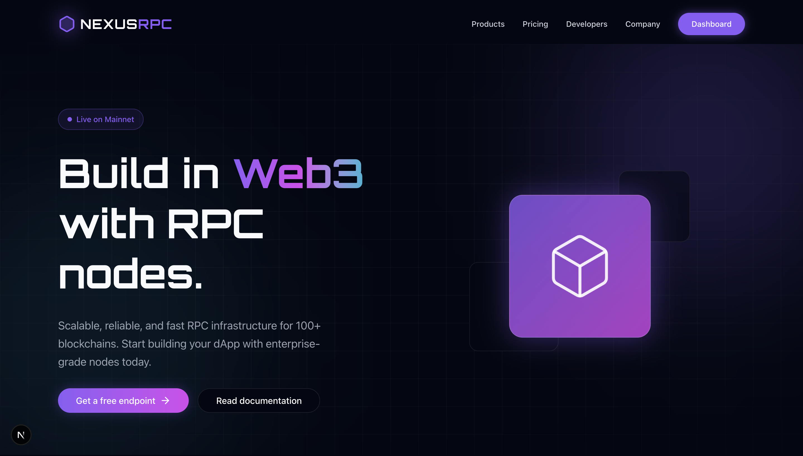

# NexusRPC - Web3 Infrastructure Landing Page


*(Concept based on GetBlock design language)*

> **Live Demo:** [https://nexus-rpc.vercel.app/](https://nexus-rpc.vercel.app/)

## 🚀 About This Project

This project is a high-performance, responsive landing page built as a portfolio piece for the **Junior Frontend Developer (Marketing Team)** role at **GetBlock**.

It demonstrates my ability to:
- **Build modern, visually stunning UIs** that align with Web3 aesthetics (Cyberpunk, Dark Mode, Glassmorphism).
- **Implement complex layouts** and interactive elements (Pricing Toggles, Animated Grids) using **Next.js** and **Tailwind CSS**.
- **Optimize for conversion** with clear CTAs and engaging animations using **Framer Motion**.
- **Move fast** by utilizing AI-assisted workflows to prototype and refine production-ready code.

## 🛠 Tech Stack

- **Framework**: [Next.js 14+ (App Router)](https://nextjs.org/) - For SEO, performance, and server-side rendering.
- **Styling**: [Tailwind CSS v4](https://tailwindcss.com/) - For rapid, maintaining styling and custom design systems.
- **Animations**: [Framer Motion](https://www.framer.com/motion/) - For complex 3D transforms and scroll reveal effects.
- **Icons**: [Lucide React](https://lucide.dev/) - For consistent, lightweight iconography.
- **Language**: TypeScript - For type safety and code reliability.

## ✨ Key Features

1.  **Cyberpunk Design System**: Custom Tailwind configuration for neon gradients, glassmorphism effects, and glowing text.
2.  **3D Animated Hero**: Engaging entrance animations to capture user attention immediately.
3.  **Interactive Pricing Table**: JavaScript-driven toggle for Monthly/Annual billing with automatic discount calculations.
4.  **Split-Screen Login Page**: A dedicated `/login` route featuring a cinematic dashboard preview and social auth layout.
5.  **Responsive Layouts**: Fully adaptive design that works seamlessly on Mobile, Tablet, and Desktop.

## 🏁 Getting Started

1.  **Clone the repository**:
    ```bash

    git clone https://github.com/LazyBoneJC/NexusRPC.git
    cd NexusRPC
    ```

2.  **Install dependencies**:
    ```bash
    npm install
    ```

3.  **Run the development server**:
    ```bash
    npm run dev
    ```

4.  **Open locally**:
    Visit [http://localhost:3000](http://localhost:3000) to see the application.

## 🎨 Design Decisions

- **Why Next.js?**
    For a marketing site, SEO and Load Speed are critical. Next.js provides Server Components by default, ensuring the landing page loads instantly even on slower connections.
- **Why Tailwind CSS?**
    It allows for rapid iteration on the "Cyberpunk" theme. Using utility classes like `bg-white/5` (glass effect) and custom `text-glow` utilities made it easy to match the GetBlock aesthetic.
- **Why Framer Motion?**
    To give the site a "premium" feel. Subtle entrance animations on scroll (like the Protocol Grid) make the page feel alive without overwhelming the user.

## 📄 License
This project is for educational/portfolio purposes.
